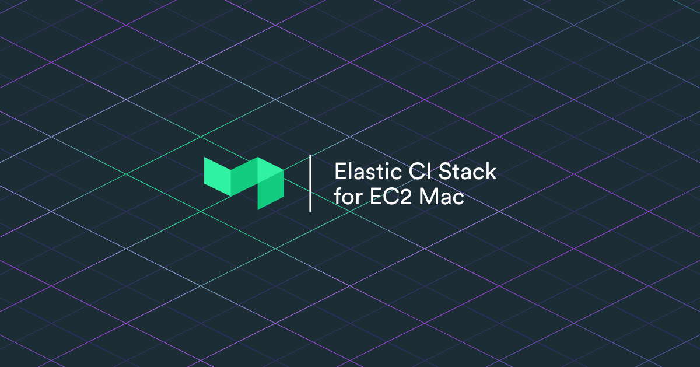

Elastic CI Stack for EC2 Mac helps you setup an auto scaling pool of [AWS EC2 Mac instances](https://docs.aws.amazon.com/AWSEC2/latest/UserGuide/ec2-mac-instances.html) running the [Buildkite Agent](https://github.com/buildkite/agent) for your macOS, iOS, iPadOS, tvOS, and watchOS projects.

It consists of a CloudFormation template that creates an auto scaling group, launch template, and host resource group to launch a pool of EC2 Mac
instances.

### [Documentation →](https://buildkite.com/docs/agent/v3/elastic-ci-stack-for-ec2-mac/autoscaling-mac-metal)

It's currently in beta, and currently requires a bit more setup than the Linux-based [Elastic CI Stack for AWS](https://github.com/buildkite/elastic-ci-stack-for-aws). See the [documentation](https://buildkite.com/docs/agent/v3/elastic-ci-stack-for-ec2-mac/autoscaling-mac-metal)
for how to prepare and deploy this template to your AWS Account.

## Questions and support

As this is an early beta, please feel free to email support@buildkite.com with questions, or create a GitHub issue.

You can also drop by the `#aws` channel in [Buildkite Community Slack](https://chat.buildkite.com/) for community support related to AWS.

## Licence

See [Licence.md](Licence.md) (MIT)
